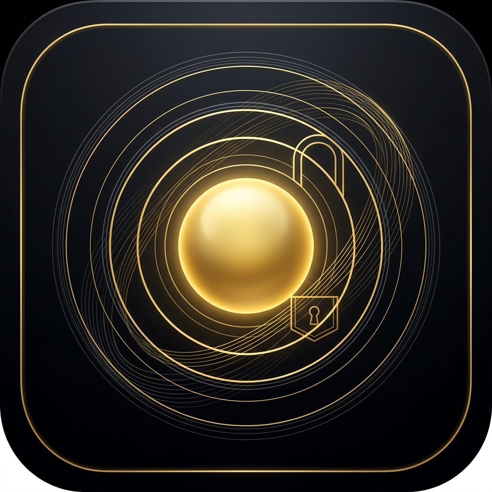
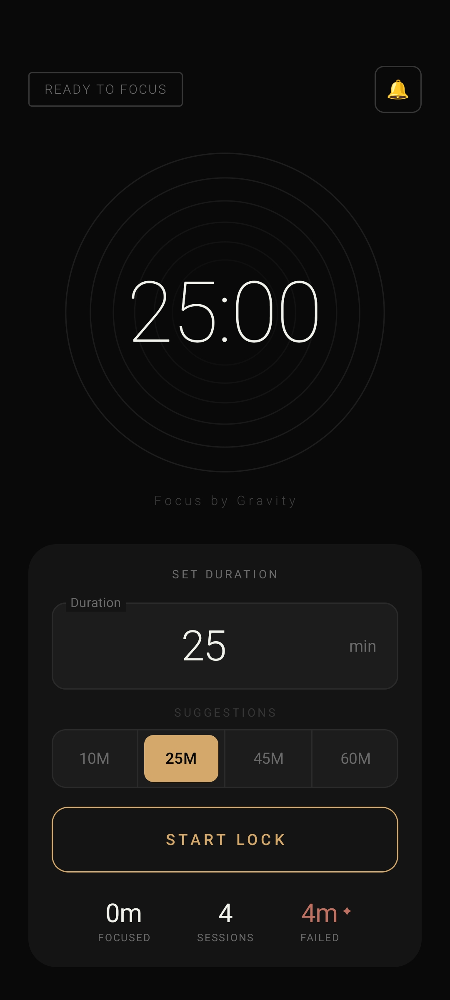
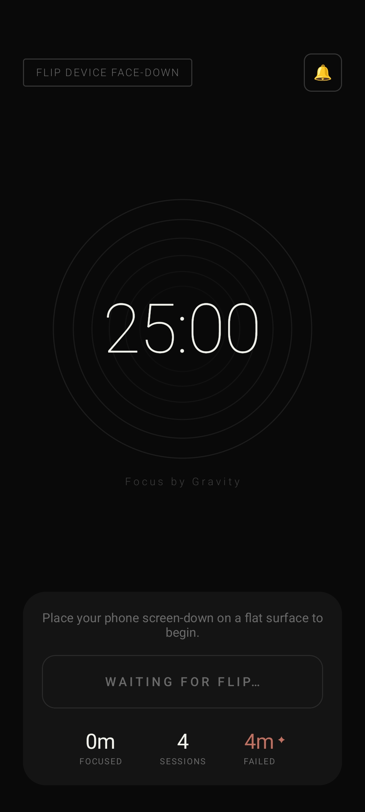
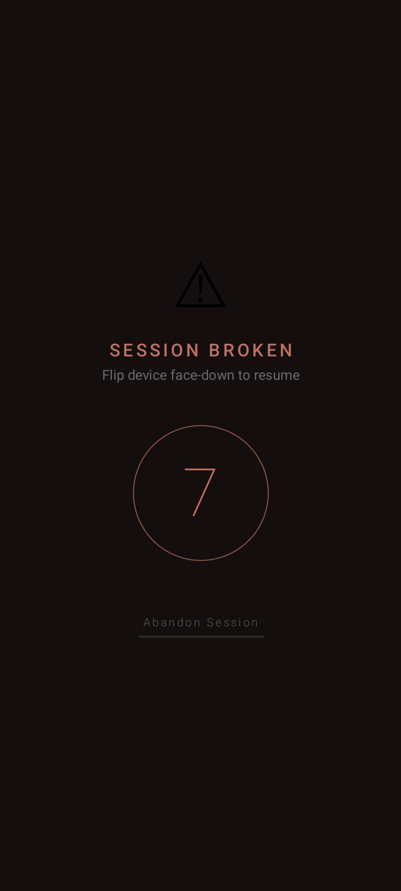

# FlipLock — Focus by Gravity

<p align="center">
  
</p>

FlipLock is an elegant, minimalist focus application for Android designed to help you reclaim your productivity. Built on the core principle of **Focus by Gravity**, the application turns focusing into a tactile habit.

Simply set your focus duration, place your phone **flat face-down** on a surface, and FlipLock will secure your environment. If you pick up the phone, a repeating alarm sounds, initiating a 10-second grace countdown. Place it back down to resume, or hold the discreet "Abandon Session" button to intentionally end your session.

---

## 📸 Interface Preview

Here is how the application guides your focus flow:

| 1. Duration Picker | 2. Ready to Focus | 3. Full Focus Mode | 4. Grace Period |
| :---: | :---: | :---: | :---: |
|  |  |  |  |

---

## ⚡ Core Features

*   **Gravity Locking (Sensor Fusion)**: Leverages your device's Accelerometer (Z-axis flat detection) and Proximity sensor to guarantee the device is fully face-down.
*   **Hardware Calibration**: Includes an interactive 1-screen hardware verification test upon first launch to ensure your device's sensors and permissions are fully compatible.
*   **Do Not Disturb Focus Mode**: Automatically toggles Android's DND mode to block incoming alerts and calls **only** while you are actively focusing, restoring your previous system state immediately on pause or session end.
*   **Discreet Abandon Button**: Provides a long-press action (hold for 2 seconds with an interactive progress indicator) to exit sessions deliberately without accidental triggers.
*   **Focus Analytics**: Logs completed focus blocks, total sessions, and failed minutes locally.
*   **Premium OLED Theme**: A gorgeous, battery-saving dark interface with gold-accented typography and breathable canvas animations.

---

## 🛠️ Build and Setup

To build the application locally:
1. Clone this repository.
2. Ensure you have the Android SDK and Android Studio installed.
3. Open the project in Android Studio.
4. Build or install using Gradle:
   ```bash
   ./gradlew installDebug
   ```

---

## 🤝 Contributing

We believe in open collaboration! **FlipLock is open for any contribution**, whether it's fixing bugs, refining the sensor fusion algorithms, adding localization, or polishing the user interface animations.

Please read our [CONTRIBUTING.md](CONTRIBUTING.md) to get started on submitting a Pull Request or raising an issue.

---

## 📄 License

This project is licensed under the terms of the [GNU General Public License Version 3](LICENSE).
